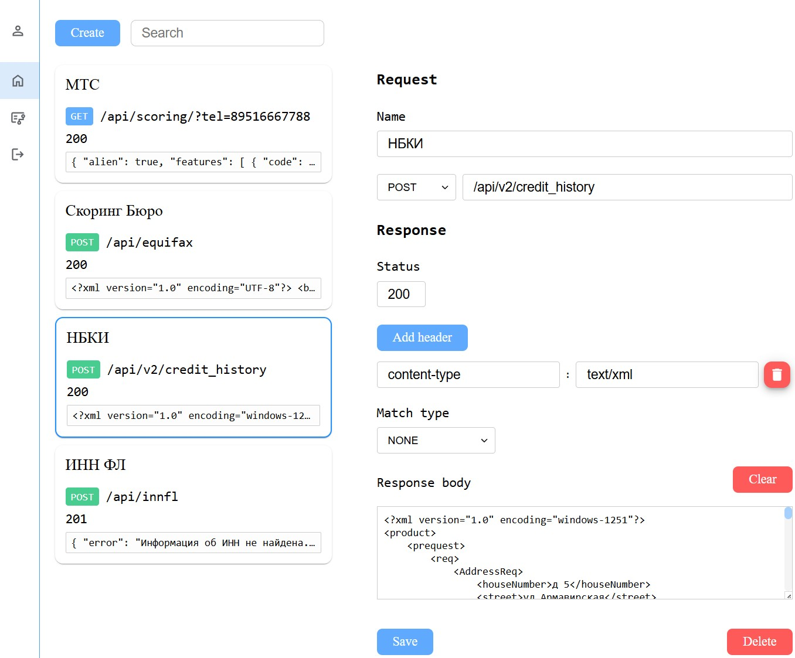

# Mock It
Моксервер с графическим интерфейсом для имитации ответов API.

<details>
<summary>Добавление или редактирование мок ответа</summary>

</details>

<details>
<summary>Страница просмотра логов</summary>

</details>

## Запуск мок сервера
Для запуска мок сервера необходим docker-compose.
Выполнить команду из корня проекта:
```bash
docker-compose up
```
После развёртывания контейнеров, станут доступны:
- frontend -  http://localhost:21000
- Rest API: http://localhost:20000 
- Swagger - http://localhost:20000/docs
